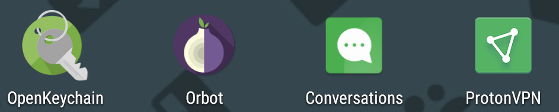

# 15 Августа, Четверг. 

## 00:00 по МСК.
###   Прикоснуться к солнцу
Мысли о безопасности почему-то посещают меня ночью. Да, у нас нигде этому не обучают. Но сейчас не об этом. Надо задуматься о чем-то большем. P2P, I2P, Jabber, VPN, proxy, PGP, OMEMO, veracrypt и множество другого... Пожалуй, приватность это нечто большее, чем любят упоминать. Пора поднимать свои хосты, выкачивать дампы и создавать своё сборище полезных сайтов и программ в mesh сетях. Пока они не сгорели под опаляющим солнцем лицензий и времени.

Негоже слепо уверовать "мне нечего скрывать, я чист кристально". При желании на каждого можно нашить пару пожизненных. Но суть не в этом. В наше время полной анонимности и приватности не существует. Вы уверены, что вам нечего скрывать? Тогда зачем вам замок на входной двери?  Зачем вам ширмы? Зачем вам пароли для различных аккаунтов?  А если я скажу, что метаданные дают о вас больше информации, чем вы оставляете? Знаете ли вы про exif? Про требования приложений? Какая информация и куда уходит?  Какие логи они создают? Если кратко, то о вас знают все: лицо, голос, местоположение, с кем и когда разговаривали, наиболее часто употребляемые слова, почту, каким WiFi вы пользовались, где проходили, какая марка телефона, часто посещаемые сайты, история запросов и многое другое. Вы считаете, что не стоит оставлять эту информацию приватной? 

## 16:05. 
### Я здесь автор и мне решать какую книгу я пишу
Существует множество способов закопать скелеты поглубже и никогда не доставать их из шкафа. Я сейчас говорю не про синь с наркотиками, серную кислоту или пироманию. 
> Что написано пером, то не вырубить топором

Соответствует ли реальности сия народная мудрость в эпоху рубильника с единой точкой отказа?  Технологически мы не так далеко ушли от предков, как нам кажется. Все так же используются принципы сарафанного радио. Лучше всего слышно самый громкий голос, а неудобные ссылки... они никогда не откроются. Представьте ситуацию. Некто совершает технологический прорыв и хочет поделиться исследованием, но это противоречит интересам третьих лиц. Объявляют крестовый поход за освобождение мыслей простых смердов от ереси. Чем все это заканчивается мы уже знаем из многочисленных летописей. Массовые скопления людей начинают отвергать цензуру как нечто инородное, опухоль в информационном теле. Даже, если пациент больше мертв, чем жив находятся способы расшаривания информации вопреки запретам. А в нынешнее время распределенных сетей, ботнетов и `охх, как же я не хочу прописывать в этом контексте подобного` всемирной глобализации могут вершиться и ответные рейды. Представьте себе поток туристов со всего мира в одну отдельно взятую точку на карте. Направленный блэкаут... Его влияние может свободно менять политические курсы, экономику, затыкать рты неугодным. Мертвецы не расскажут вам сказок, не так ли? А если я скажу, что их никогда не существовало? Доказать обратное вы не в силах. Загробный мир, знаете ли, у каждого свой. Правда рождается в споре? А если правда у каждого своя? Выходит нет правды? Спросите это у архивов. Клавиатура знает больше всех. Да, человек в любое время предпочитал иметь доступ к информации и возможность контроллировать ее. Главная офшорная валюта сея целомудрия стоящего на трёх китах: интересах, массах и тех, чьи имена останутся навсегда под грифом совершенно секретно. Каждый из нас создатель этой экосферы. 8 чудо не предел, мы можем создать нечто большее. Кто-то может может сделать это и в одиночку. Однако, кому это надо? Что нами создано? Ничего достойного. Спам, рассылки, реклама.... Open Source проекты, приватный софт высшей пробы, глобальные паутины все крепче оплетающие наш мир. Это два разных мира, где  первый существует за счёт .45 калибра у виска. Вопрос что произойдет раньше экзистенциальный коллапс международной сети от скопившегося в потрохах мусора или образование новых изолированных соединений. Каждый думает что может делать все, что душе угодно. Сам себе адвокат, пальцы к верху,тпыль в глаза... Все, чтобы заполнить бездну в чертогах своих мыслей. Так с какой стати тебя так волнует мир и его состояние? Ты создаешь его сам. Ты видишь результаты действий в real time, ну или с некоторой задержкой до затерянной где-то в закромах вселенной дремучей железки из серверной 
> PS. Блокчейн как идея - почти шедеврально. Как инструмент для использования на текущий момент - слишком сыро. Или я куда-то не туда смотрю. Все распределенные системы имеют единую точку отказа(хотя по задумке ее быть не должно), множество огрехов в алгоритмах работы. Если говорить о наиболее удачных реализациях этой технологии... Ну, наверное  mesh сети

## 16:59.
###   0 или 1
 Стоит написать себе пару писем в будущее. Да, не изменюсь, да, знаю это заранее...
> Де юре трезво мыслю, но де факто постоянно в салат.

####  Рожденный в пламени так жить не может.
 Наш мир не из нуара, нет. Не стоит ассоциировать его с бардаком в вашей голове и выдавленной улыбкой по будням. Вы не жалеете, не плачете, не ждёте чего-то нового. А зачем? Время не лечит, лишь разлагает на плесень и липовый мед. Уберечь бы что-нибудь, да нет ничего святого, ведь время - механизм с осечкой. Всегда есть другой сценарий, где иные ценности.
#### Рожденные ползать только б в небе ожили. 
Пёс с ними. Деревья помнят все. Осточертело делать вид что все пиздато, но мечтать попасть под поезд... Поговорим на равных... Клавиатура знает больше правды, чем самые родные люди. Переверни еще разок кресты,
и поздно думать,
поздно делать. Зависнув над бездною на лезвии ножа ты выбираешь меж бессмертия иль погоста? И стоя на краю обрыва все так же веришь голосам, что внемлют, мол ты непобедимый? Не коллекционируй чувства, ты и без того коллектор. Отвергаешь память, готов жертвовать любыми людьми, даже временем с любимыми людьми. На кой? Ведь быть больше всех любимым - собой.
#### Рожденным в небе только ползать гоже. 
Тут нет друзей, если не ловит сотовый. Отчаяние приходит с опытом. Неважно сколько денег у тебя, власти и славы. И все одинаковы в погоне за высотами. Смотрите все отборнейшие фрукты, но лишь ножом поройся в мякоти и сок выходит одинаковый. Когда-нибудь ты просто так же сдохнешь как и все. Ты пустота в  квадрате, домик для червей. И ты думал понял эту жизнь,
придурок... 
Мы просто прикоснувшиеся к солнцу. 
#### Чёрные полосы летописей свернулись в бесконечность.
 Пустые глаза прохожих внушают, что так оно и должно быть, но даже у атлантов не выдерживают плечи под бременем времён. Пропитывая ядом воздух одинаково гнием, говорим о моральном здоровье, когда никто не хочет думать и мечтать, ведь из домов панельных не виден космос и уж тем более звезды. Хотя какие звезды среди бетона и стекла? Мы деградируем под очернения с экранов, храня в душе те тайники, что были выжженны с изьяном. 

## 23:42 
###   На щите
Люди строят культы ради поглащения. Культы личностей, что создают бесполезный мусор. Участие в мероприятиях крупного уровня почему-то связывает в головах мысли, что человек чего-то достиг. Что этим можно гордиться, но что после нас останется? .45 калибр, мир литер и пара отверстий в автопортете на стене, да мир фантазий, где эти достижения смогли пригодиться. Что же я могу сказать о мероприятиях крупного уровня? Цирк направленный на массы. Есть гении, есть фабрики звёзд... Не каждый может отличить одно от другого. 
> Завышенные ожидания или принятие реальности такой, какая она и есть?

 Все, что связано с публицистикой живёт лишь несколько столетий, да изредка всплывает в истории человечества подобно всем известной субстанции органического происхождения. Ведь говорить как и кого ***** - самый лучший способ ***** целые народы. Ценности чего-то стоят лишь до тех пор, пока не знаешь какими усилиями они были достигнуты. Массовость или элитарность? Хммм... Не имеет ничего общего с темой повествования. 

##  23:55
###    Какова цена твоей жизни?
Бесценна и в то же время продаётся за сапоги, да корку хлеба
